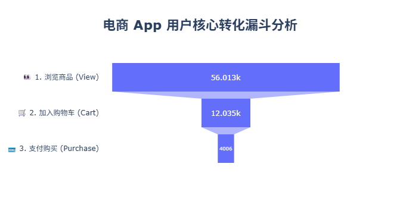
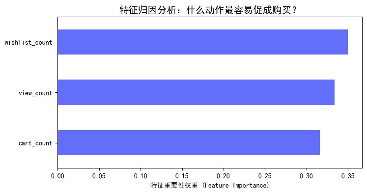
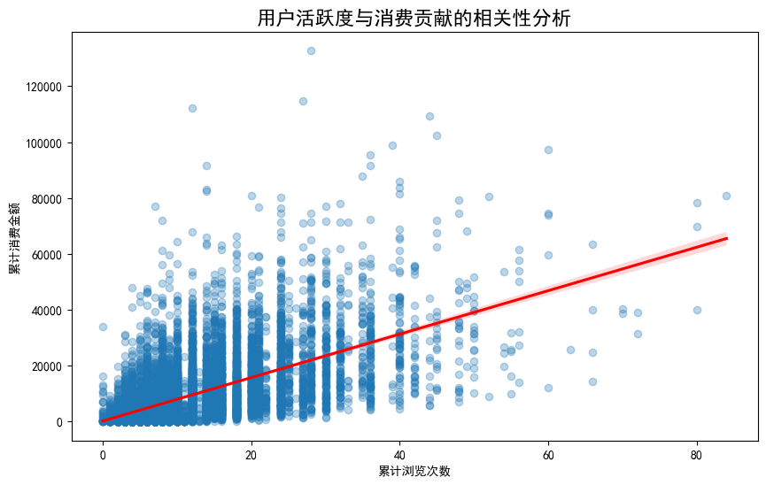

# E-commerce User Behavior Analysis

- [Project Overview](#project-overview)
- [Key Technical Modules](#key-technical-modules)
- [Visualization Highlights](#visualization-highlights)
- [Business Impact](#business-impact)
- [Tech Stack](#tech-stack)
- [Model Optimization: Handling Class Imbalance](#model-optimization-handling-class-imbalance)
- [Future Improvements](#future-improvements)

## Project Overview
This project provides a comprehensive analysis of e-commerce user behavior data. The goal is to identify bottlenecks in the user journey, segment high-value users, and predict purchase intent using machine learning models.

### 📊 Data Source & Quick Start
- **Data Source:** The dataset (`events.csv`) contains simulated e-commerce user behavior logs (views, cart additions, purchases) to demonstrate the analysis pipeline. No sensitive real-world company data is included.
- **Quick Start:**
  1. Clone the repository.
  2. Install dependencies using `pip install -r requirements.txt`.
  3. Run the Jupyter Notebook `ecommerce_full_funnel_and_prediction.ipynb` to reproduce the analysis.

## Key Technical Modules
- **Funnel Analysis:** Identified a 7.15% conversion rate from view to purchase, highlighting the "Cart to Purchase" stage as the primary bottleneck.
- **RFM Customer Segmentation:** Performed RFM modeling to profile high-value user segments.
- **Purchase Intent Prediction:** Built an XGBoost classifier to predict user purchases. Achieved a 67% accuracy rate and identified `wishlist_count` as a critical predictive feature.

## Visualization Highlights
**1. Conversion Funnel**

**2. Feature Importance (XGBoost)**

**3. Activity vs. Revenue Correlation**

## Business Impact
The analysis provides actionable insights for:
- Optimizing conversion pathways at the checkout stage.
- Targeted marketing strategies for different RFM segments.
- Resource allocation based on high-impact predictive features.

## Tech Stack
- **Languages:** Python
- **Libraries:** Pandas, Scikit-learn, XGBoost, Plotly, Seaborn

## Model Optimization: Handling Class Imbalance
In the initial XGBoost model, severe class imbalance (non-purchasers heavily outnumbering purchasers) led to a high overall accuracy (67%) but a critically low recall (0.02) for the minority class. 

To resolve this, I implemented **Cost-Sensitive Learning** by calculating the exact class ratio and passing it to the `scale_pos_weight` parameter. 
- **Business Impact:** The recall for actual purchasers skyrocketed from **2% to 50%**. While this slightly reduced the global accuracy to 51%, it perfectly aligns with the real-world business objective: capturing as many potential buyers as possible is far more valuable than correctly identifying non-buyers.

## Future Improvements
- **Causal Inference via A/B Testing:** The current Chi-Square test relies on observational data, which proves correlation but not strict causation between `wishlist_count` and purchases. In a real-world business setting, I would design a randomized A/B test (e.g., hiding the wishlist feature for the control group) to rigorously quantify the incremental causal impact.
- **Data Enrichment:** Integrate user demographic data to further refine RFM segments.
- **Model Tuning:** Implement hyperparameter optimization (e.g., using GridSearchCV or Optuna) to improve prediction metrics.
